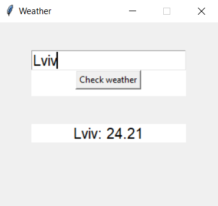

# tkinter-weather

The weather (temperature) program is written in Python using the Tkinter library

To start it:
1. In the main.py file, in the line 'key =' write your API key, which you will get in 'https://openweathermap.org/api'
2. Open main.py file
